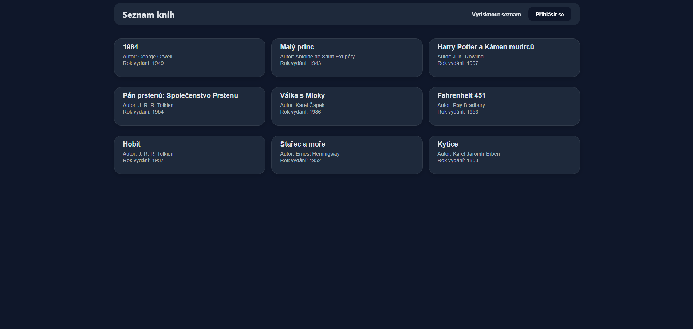

# 📚 Book Catalog Web Application

A full-stack web application for managing and displaying a catalog of books. Built with PHP 8.2, MariaDB, Docker, and pure vanilla JavaScript/SASS with a strong focus on clean UX/UI and secure code principles.




---

## 🌟 Key Features

### 🌐 Public Interface
- **Book Overview:** Clean, grid-based listing of available books (Title, Author, Release Year).
- **Book Detail View:** Interactive view displaying extended information, including annotations and ratings (0–5).
- **Print View:** Dedicated `@media print` CSS layer allowing clean, paper-friendly printing of the catalog without UI clutter (navigation, buttons, background colors).

### 🔐 Administration Panel
- **Secure Authentication:** Protected admin login utilizing PDO prepared statements and `password_hash` / `password_verify` encryption to prevent XSS and SQL Injection.
- **Add New Book:** Form with both client-side and strict server-side validation (range validation for publication year and ratings).
- **Batch Import:** Ability to import books in bulk from a predefined `books.json` file.
- **Form State Persistence:** Preserves input data and provides intuitive error feedback upon validation failure.

---

## 🎨 UX & UI Design Decisions

- **DOM XSS Protection:** Clean dynamic rendering using standard DOM manipulations (`document.createElement` & `textContent`) rather than unsafe `innerHTML` injection.
- **Intuitive Navigation:** Responsive, accessible layout designed for effortless navigation across desktop and mobile devices.
- **Optimized Feedback:** Clear, real-time error indicators for authentication and form submission.

---

## 🛠 Tech Stack

- **Backend:** PHP 8.2 (Pure PHP / Native PDO)
- **Database:** MariaDB
- **Containerization:** Docker & Docker Compose (Apache + PHP environment)
- **Frontend:** HTML5, JavaScript (ES6+), SASS / SCSS
- **Version Control:** Git

---

## 🔐 Default Admin Credentials

For testing the administration interface, use the following pre-configured credentials:

| Parameter | Value |
| :--- | :--- |
| **Login URL** | `http://localhost:8080/login.html` |
| **Username** | `admin` |
| **Password** | `admin` |

---

## 🚀 Quick Start & Installation

### Prerequisites
- [Docker Desktop](https://www.docker.com/products/docker-desktop/) installed and running.
- [Node.js](https://nodejs.org/) (optional, only required for watching SASS changes).

### 1. Launch Environment via Docker
Clone the repository and run Docker Compose from the project root:

```bash
git clone [https://github.com/scrxtch666/book-catalog.git](https://github.com/scrxtch666/book-catalog.git)
cd book-catalog

# Build and start containers in the background
docker-compose up -d --build
